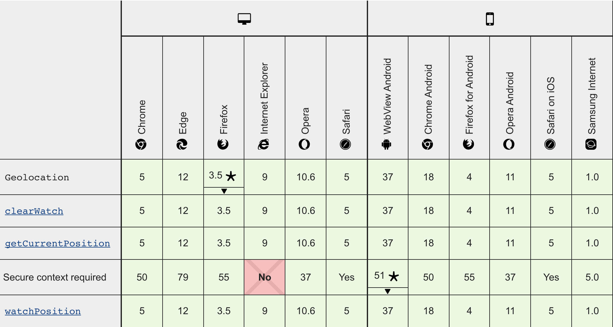

# Въведение

Много различни видове хора използват HTML5 Geolocation: от напреднали web разработчици до начинаещи, до хора, които започват да програмират за първи път в кариерата си. Тези документи са написани за всички учащи, независимо от тяхното ниво на опит или произход.

# Изисквания
За да работите с HTML5 Geolocation API, ще трябва да имате разбиране за основите на JavaScript. Ако сте нови в JavaScript или имате нужда от припомняне, можете да се използвате Mozilla Developer Network за референция.

# Browser compatibility

